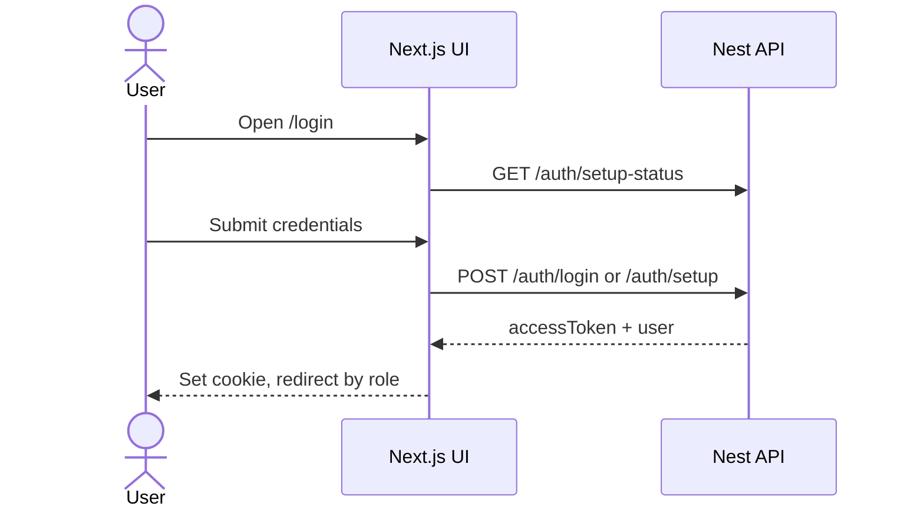
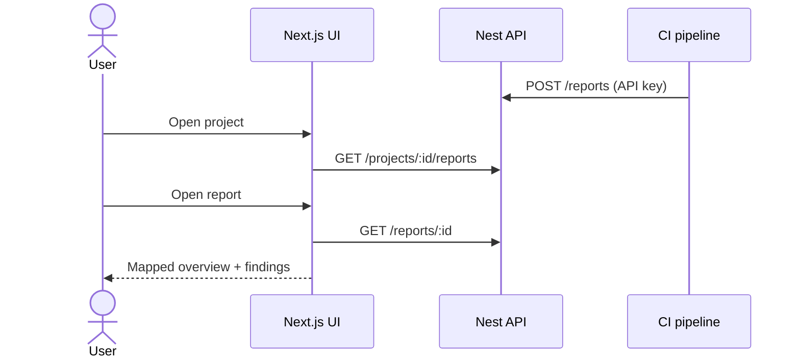

# UTC Auditor UI — how it works (wiki paste)

Paste this page into Confluence or Notion. Keep the Mermaid blocks; both tools support them with a Mermaid / code macro. Full detail: `docs/FUNCTIONALITY.md`, `docs/API.md`, `docs/SEQUENCES.md`, `docs/QA_CHECKLIST.md`.

---

## 1. What this app is

UTC Auditor UI is the **dashboard** for audit reports. It runs on **port 3001**. The Nest API (`utc-auditor-be`) on **port 3000** is the source of truth.

The browser does **not** call Nest directly for data. Next.js is a BFF:

- Login/setup/logout → Next `/api/auth/*`
- Pages and modals → Next server components / server actions → Nest `/api/...` with a JWT

| Role | Can do |
| --- | --- |
| **Admin** | All clients; create clients, users, projects; rotate API keys; view all reports |
| **Client** | Own workspace only; view projects and reports; no management actions |

Reports are **uploaded by CI**, not by the dashboard:

`POST /api/reports` + header `X-API-Key: utc_...`

---

## 2. User journeys

**First install:** `/login` → setup form → `POST /auth/setup` → admin dashboard.

**Admin day-to-day:** sign in → overview (clients + charts) → client workspace → project card → report → optional detailed quality page.

**Client day-to-day:** sign in → own workspace → same report views, no create/edit/key buttons.

**Session:** httpOnly cookie `utc_session` (7 days) stores the JWT and role. Middleware blocks `/dashboard/*` without it. Logout only clears the cookie.

---

## 3. Screens

| URL | Purpose |
| --- | --- |
| `/login` | Setup or sign-in |
| `/dashboard` | Admin overview (clients redirect here to their workspace) |
| `/dashboard/client/{clientId}` | Projects board + sidebar |
| `.../project/{projectId}` | Single project |
| `.../report/{reportId}` | Overview / findings / JSON |
| `.../report/{reportId}/details` | Parsed quality dashboard |

The dashboard **refreshes every 20 seconds** while the tab is visible so new CI reports appear without a manual reload.

---

## 4. API cheat sheet

Browser → Next:

- `GET /api/auth/setup-status`
- `POST /api/auth/setup` `{ name, email, password }`
- `POST /api/auth/login` `{ email, password }`
- `POST /api/auth/logout`

Next → Nest (`Authorization: Bearer` except auth):

| Method | Path |
| --- | --- |
| GET | `/clients`, `/clients/:id` |
| POST | `/clients` |
| POST | `/users` |
| GET | `/projects`, `/clients/:id/projects`, `/projects/:id` |
| POST | `/clients/:id/projects` |
| PATCH / DELETE | `/projects/:id` |
| POST | `/projects/:id/api-keys`, `/projects/:id/api-keys/regenerate` |
| GET | `/projects/:id/reports?page=1&limit=20`, `/reports/:id` |
| POST (CI only) | `/reports` with `X-API-Key` |

List endpoints return at most **20** reports per project in the UI. Sparse list rows may trigger extra `GET /reports/:id` (up to 12).

---

## 5. Sequence (sign-in)



## 6. Sequence (view reports)



More diagrams: `docs/SEQUENCES.md`.

---

## 7. QA (short)

- Setup vs login modes
- Admin vs client isolation
- Create client / user / project / key
- Ingest report via API key; appears after refresh
- Report overview + details; bad JSON on details → 404
- Logout; backend-down error

Full list: `docs/QA_CHECKLIST.md`.

**Placeholders (do not fail):** Forgot password, Remember me, in-app report upload, API pages beyond the first 20 reports.

---

## 8. Run locally

```bash
cp .env.example .env.local   # BACKEND_URL=http://localhost:3000
npm install
npm run dev                  # http://localhost:3001
```
