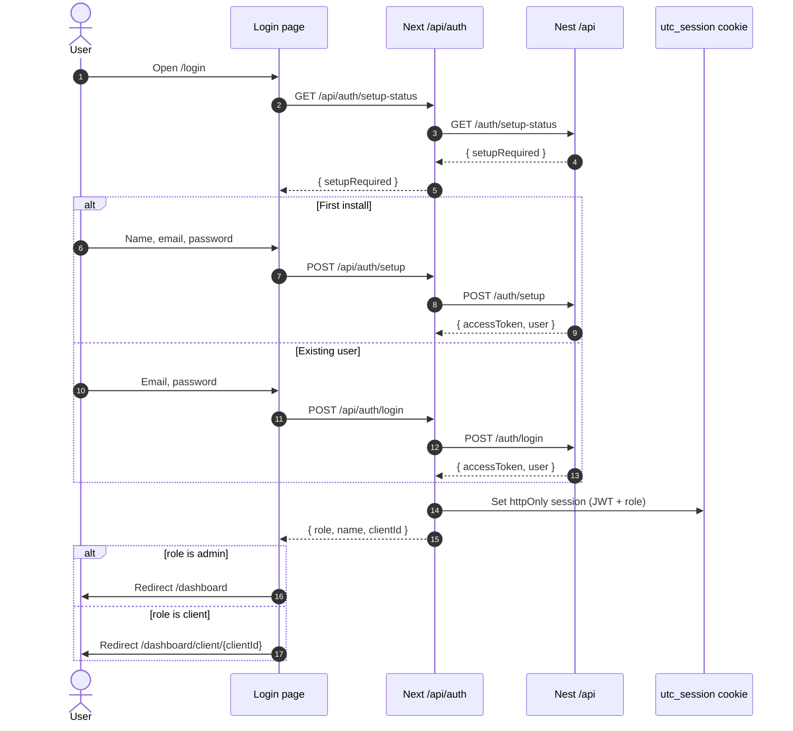
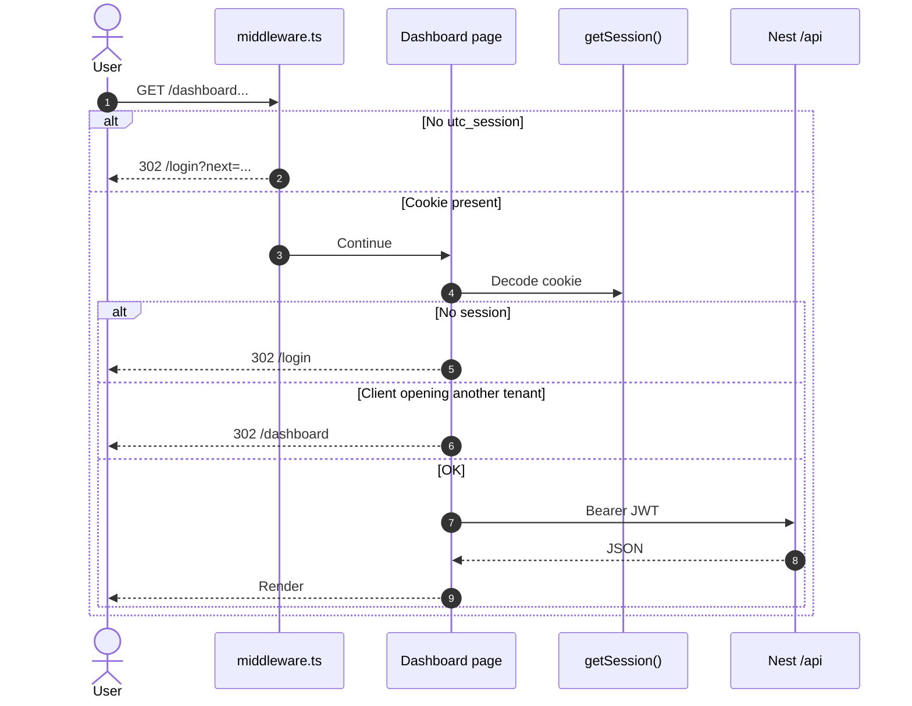
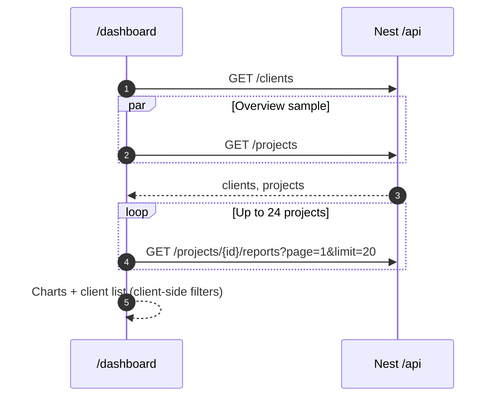
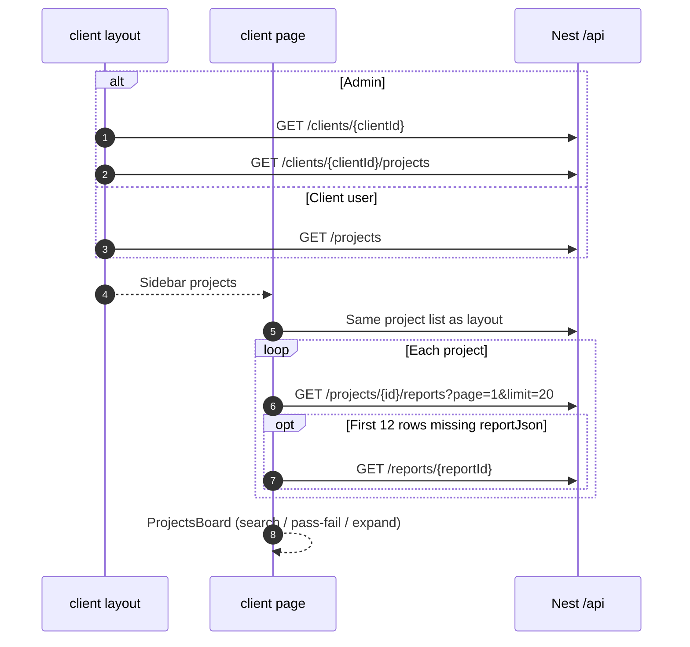
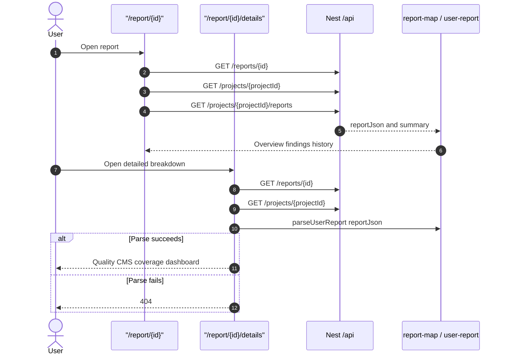
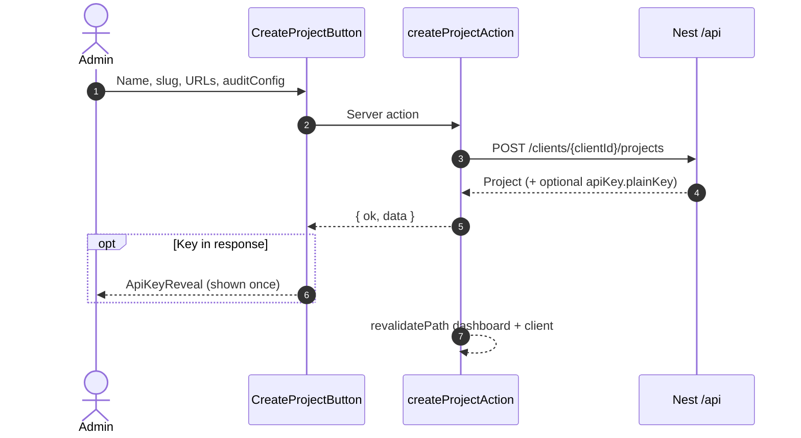
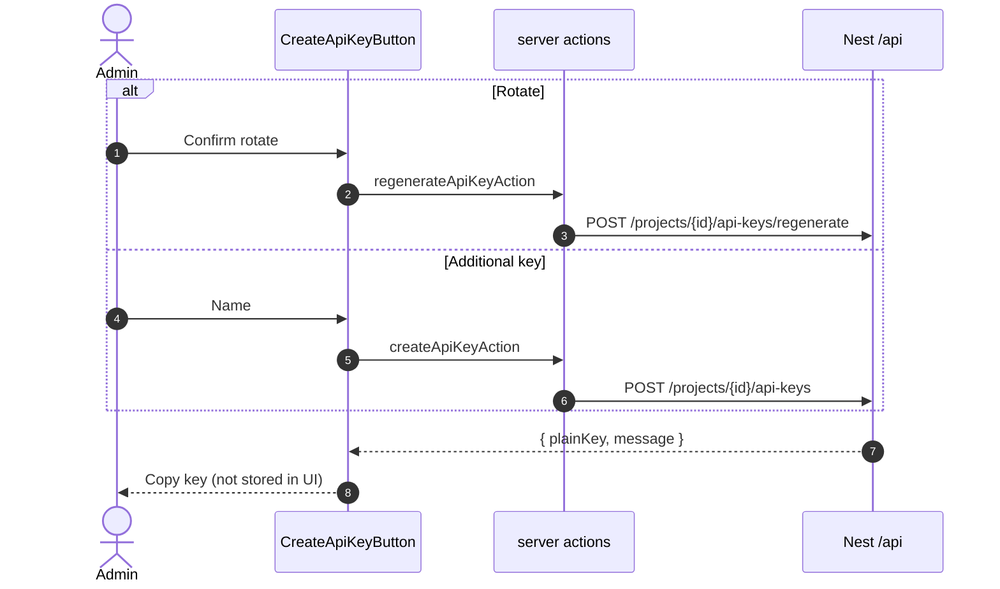
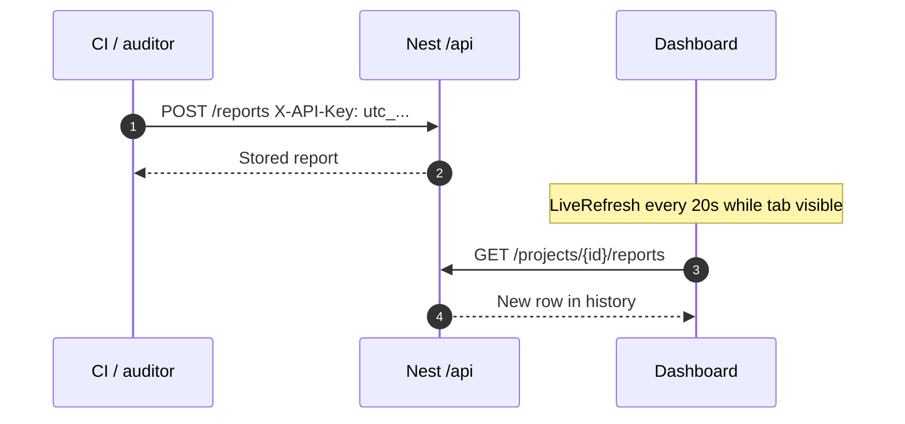
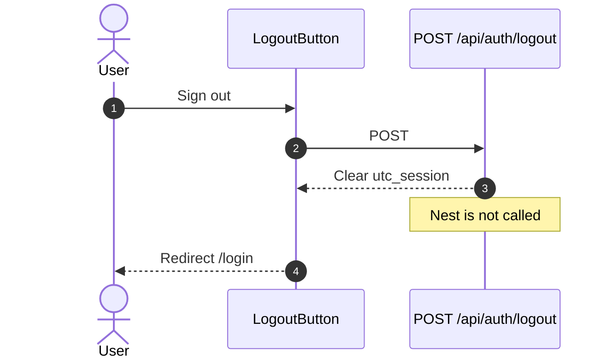

# Sequence diagrams

Copy these Mermaid blocks into Confluence (Mermaid macro), Notion, GitHub, or the backend wiki. They match the current UI code.

## Sign-in and first-run setup

## Route guard and session

## Admin overview load

## Client workspace and project board

## Open an audit report

## Admin write: create project and reveal API key

## Rotate or add a project API key

## CI report ingest (outside the dashboard)

## Sign-out

## Other admin writes (same pattern)

| UI | Server action | Backend |
| --- | --- | --- |
| Create client | `createClientAction` | `POST /clients` |
| Create user | `createUserAction` | `POST /users` |
| Edit project | `updateProjectAction` | `PATCH /projects/:id` |
| Deactivate project | `deleteProjectAction` | `DELETE /projects/:id` |

All of those send `Authorization: Bearer {JWT}` from the session cookie.
